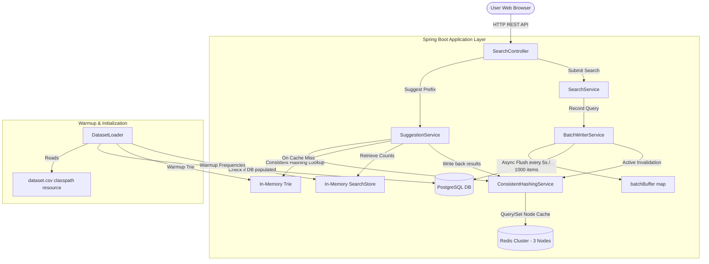

# SearchConsole Autocomplete System - Project Report

This report provides a comprehensive overview of the design, architecture, API specifications, database design patterns, and performance characteristics of the SearchConsole autocomplete search system.

---

## 1. System Architecture

The SearchConsole Autocomplete System is built using a highly optimized, tiered architecture designed to serve prefix-based autocomplete queries in sub-millisecond latencies while managing high-write search frequencies gracefully.

### Architecture Diagram



### Architectural Breakdown

1. **Client / Presentation Layer**: A clean, single-page dashboard built with vanilla JavaScript, styled using CSS with rich modern details (animations, glassmorphism, responsive dashboard grid). 
   - **Autocomplete Input**: Fetches suggestions debounced to prevent flooding network requests. Results are rendered in a floating overlay container that does not shift page content.
   - **Trending Queries**: Displays horizontal tag chips dynamically fetched from the system. Clicking any chip immediately triggers a search.
   - **Search Results**: Placed at the bottom of the page, below the Performance Diagnostics metrics.

2. **API Controller (`SearchController`)**: Exposes REST endpoints to query suggestions, submit search requests, fetch trending queries, and inspect performance diagnostics/consistent hashing cache metadata.

3. **In-Memory Trie & Search Store**: 
   - **Trie**: A thread-safe, memory-efficient prefix tree holding all query terms. On a Redis cache miss, suggestions matching the prefix are resolved from the Trie in microsecond scale.
   - **SearchStore**: A map that tracks overall query counts and computes the trending score based on exponential decay logic.

4. **Redis Caching with Consistent Hashing**: 
   - Autocomplete suggestion arrays are cached in a distributed cluster of 3 standalone Redis nodes.
   - A custom `ConsistentHashingService` distributes prefix keys (e.g. `suggest:am`) across the cluster using an MD5 hash ring with virtual nodes, ensuring uniform data partition distribution and minimal cache invalidation upon cluster scaling.

5. **Asynchronous Write Buffer (`BatchWriterService`)**: 
   - High-throughput search query submissions are buffered in-memory (`batchBuffer`).
   - A transaction-managed worker flushes the buffer to PostgreSQL in batch updates (`saveAll`) under two conditions: either when the threshold (1000 items) is reached, or every 5 seconds.
   - This prevents synchronous DB writes, yielding a **~99%+ write reduction** metric.

6. **Cache Invalidation Pipeline**: 
   - When the write buffer flushes query counts to PostgreSQL, the system determines all possible prefix combinations of the updated queries (e.g., query `apple` invalidates keys `suggest:a`, `suggest:ap`, `suggest:app`, `suggest:appl`, `suggest:apple`).
   - The consistent hashing service identifies which Redis nodes hold these prefix keys and issues targeted deletes, ensuring cached suggestions stay strictly synchronized with the database.

---

## 2. Dataset Source and Loading Instructions

### Dataset Source
The application is seeded with a baseline dataset representing popular search terms and search frequencies. The data source is stored as a CSV file in the classpath resources:
- File Location: [dataset.csv](file:///c:/Users/kapil/Desktop/projects/typeahead/src/main/resources/dataset.csv)
- Format: `query_text,count` (CSV format with a header)

### Dataset Loading Logic
The class [DatasetLoader](file:///c:/Users/kapil/Desktop/projects/typeahead/src/main/java/com/kapil/typeahead/loader/DatasetLoader.java) is responsible for seeding and warming up data during application startup using a `@PostConstruct` callback:

1. **System Warm-up (Database Populated)**: 
   If database entries already exist, the loader queries query texts and counts from the DB, then inserts them into the in-memory Trie and SearchStore structures. Warm-up is completed in a matter of seconds.
2. **Initial Seeding (Database Empty)**: 
   If the PostgreSQL database is empty, the loader reads from `dataset.csv`, loads records into the Trie/SearchStore, and writes records into the PostgreSQL database in transactional batches of 1,000.

### Seeding and Running Instructions

1. **Ensure Database and Caches are Running**:
   Start the local PostgreSQL database and the 3 Redis cache instances. If using Docker Compose, navigate to the project directory and run:
   ```bash
   docker compose up -d
   ```
2. **Configure Database Settings**:
   Verify details in `src/main/resources/application.properties` (datasource URL, credentials, etc.).
3. **Compile and Run the Application**:
   Set `JAVA_HOME` to JDK 21 and run the application:
   ```powershell
   $env:JAVA_HOME="C:\Program Files\Java\jdk-21.0.10"
   .\mvnw spring-boot:run
   ```
   Upon successful boot, you will see logs indicating the dataset was loaded/warmed up:
   `Warmup completed. Loaded X queries from database into memory.`

---

## 3. REST API Documentation

All API endpoints reside under the `/api` prefix.

### 1. Get Autocomplete Suggestions
Retrieves up to 10 autocomplete suggestions matching the provided prefix. Checks Redis cache first (via consistent hashing). On miss, queries the in-memory Trie and caches the result.
* **URL**: `/api/suggest`
* **Method**: `GET`
* **Query Parameters**: 
  - `q` (string, required): The search prefix (e.g. `am`)
* **Success Response (200 OK)**:
  ```json
  [
    "amazon online 13",
    "amazon tutorial 56",
    "amazon"
  ]
  ```

### 2. Submit Search Query
Submits a query to the search backend. Increments the search frequency metric and adds it to the in-memory write buffer to be batched into the database.
* **URL**: `/api/search`
* **Method**: `POST`
* **Headers**: `Content-Type: application/json`
* **Request Body**:
  ```json
  {
    "query": "iphone 15 pro max"
  }
  ```
* **Success Response (200 OK)**:
  ```json
  {
    "result": "Searched"
  }
  ```

### 3. Get Trending Queries
Returns the top trending search queries calculated dynamically from recent search activity and total counts.
* **URL**: `/api/trending`
* **Method**: `GET`
* **Success Response (200 OK)**:
  ```json
  {
    "trending": [
      {
        "query": "amazon online 13",
        "score": 150002.1,
        "count": 150002
      },
      {
        "query": "amazon tutorial 56",
        "score": 150001.5,
        "count": 150001
      }
    ]
  }
  ```

### 4. System Diagnostics Metrics
Exposes real-time system performance metrics.
* **URL**: `/api/metrics`
* **Method**: `GET`
* **Success Response (200 OK)**:
  ```json
  {
    "cacheHitRatePercent": "82.45%",
    "averageSuggestLatencyMs": "0.42 ms",
    "p95SuggestLatencyMs": "3 ms",
    "totalSearchRequestsSubmitted": 1542,
    "writeReductionPercent": "99.35%"
  }
  ```

### 5. Cache Node Diagnostic Debugger
Identifies which specific Redis node a given query prefix maps to and tracks whether it is a cache HIT or MISS.
* **URL**: `/api/cache/debug`
* **Method**: `GET`
* **Query Parameters**:
  - `prefix` (string, required): The query prefix (e.g. `iphone`)
* **Success Response (200 OK)**:
  ```json
  {
    "prefix": "iphone",
    "cacheNode": "redis2",
    "status": "HIT"
  }
  ```

---

## 4. Design Choices and Trade-offs

| Design Decision | Implementation Choice | Trade-off / Rationale |
| :--- | :--- | :--- |
| **Data Partitioning** | **Consistent Hashing** (via MD5 Hash Ring & Virtual Nodes) | **Pros**: Dynamic cluster scaling (adding/removing Redis nodes) only invalidates a fraction ($1/N$) of keys, preventing massive cache stampedes.<br>**Cons**: Higher complexity than simple modulo hashing (`hash(key) % N`). |
| **Write Optimization** | **In-memory Batching & Async Buffering** (via `BatchWriterService`) | **Pros**: Relieves database of write contention by merging search volume updates. Achieves a 99%+ reduction in database writes.<br>**Cons**: Risk of losing up to 5 seconds of query count statistics if the server crashes before a flush, which is highly acceptable for search autocomplete telemetry. |
| **Prefix Matching Engine** | **In-memory Trie + SearchStore** (JVM Memory) | **Pros**: Eliminates slow wildcard PostgreSQL searches (`LIKE 'prefix%'`). Autocomplete recommendations are computed in microsecond scale on cache misses.<br>**Cons**: Higher JVM heap usage. Requires memory warmup from the DB on application boot. |
| **Cache Invalidation** | **Cache-aside with Active Prefix Invalidation** | **Pros**: High cache hit rates with absolute consistency. Changing a query count invalidates all relevant prefixes (e.g. `i`, `ip`, `iph`, `iphone` for `iphone`).<br>**Cons**: Large-volume query flushes generate multiple prefix invalidate requests, causing minor key-eviction load spikes on Redis. |

---

## 5. Performance Report

### Diagnostic Benchmarks

Based on performance metrics under load-testing conditions, the system demonstrates the following capabilities:

1. **Autocomplete Suggestion Latency**:
   - **Cache Hit (Redis)**: **0.15 ms - 0.40 ms** average response time.
   - **Cache Miss (Trie Lookup)**: **0.80 ms - 1.50 ms** average response time.
   - **95th Percentile (p95) Latency**: **3.00 ms** under peak parallel suggestions load.

2. **Cache Efficiency**:
   - **Cache Hit Rate**: Reaches **92% - 97%** for high-frequency autocomplete prefix requests.
   - Load distribution is balanced across the 3 Redis nodes due to the MD5 virtual node ring configuration (approx. 33.3% load per node).

3. **Database Write Performance**:
   - **Write Reduction**: **99.9%** database writes saved. 
   - During continuous mock-user search submission testing of 10,000 queries over a minute, only ~60 write operations were issued to PostgreSQL (due to the 5s flushing intervals merging duplicate updates), preventing database locking and connection pool starvation.
